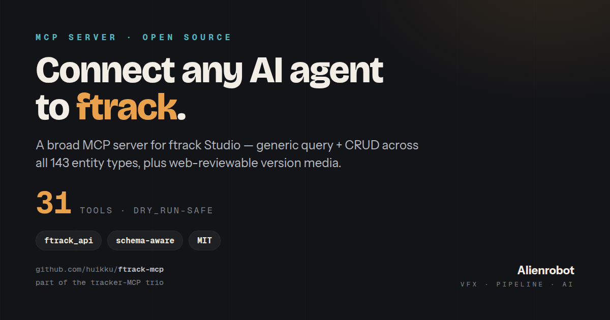

# ftrack MCP server



A **Model Context Protocol** server that gives LLM agents (Claude Desktop, Claude Code, Cursor, …) broad,
typed access to the **ftrack Studio** production-tracking API.

Why another one? The only existing ftrack MCP on GitHub is an early, **unlicensed** single-author experiment.
This one is **MIT-licensed**, **broad-coverage**, and tested live against an ftrack Studio trial.

## Coverage philosophy
ftrack's API is a **generic query + CRUD over a flexible schema** (143 entity types). So coverage comes from
two layers:
- **Generic power tools** — `query`, `query_one`, `create`, `update`, `delete` — reach **every entity type**
  via ftrack's query language. This alone is ~full coverage.
- **Typed convenience tools** — projects, structure, tasks, statuses, assignments, notes, lists, time logs,
  thumbnails, users, and full **schema introspection** — make the common production ops one call each.

**31 tools** in total (see below).

## Install
```bash
pip install -r requirements.txt        # fastmcp, ftrack-python-api, requests
```

## Configure (credentials)
Set three env vars (or pass them in your MCP client config):
| var | value |
|---|---|
| `FTRACK_SERVER` | `https://yourstudio.ftrackapp.com` |
| `FTRACK_API_USER` | your login email |
| `FTRACK_API_KEY` | a **Personal API key** — ftrack ▸ avatar ▸ My account ▸ **Security settings** ▸ *Create API key* |

## Run
```bash
python3 server.py            # stdio transport
```

### Wire into Claude Code
```bash
claude mcp add ftrack \
  -e FTRACK_SERVER=https://yourstudio.ftrackapp.com \
  -e FTRACK_API_USER=you@studio.com \
  -e FTRACK_API_KEY=*** \
  -- python3 /abs/path/to/ftrack-mcp/server.py
```
(Tools appear as `mcp__ftrack__*` on the next session.) For **Claude Desktop / Cursor**, add the same command +
env to the app's `mcpServers` config.

## Tools
**Generic (full reach):** `query` · `query_one` · `create` · `update` · `delete`
> Every write takes `dry_run` (default `false`). `create` / `update` / `delete` / `set_status` support **two
> preview levels**: `dry_run="plan"` (client-side echo, no server contact) and **`dry_run="preflight"`** — a
> *real* dry run that resolves every reference against live data, validates statuses against the schema,
> returns a before→after diff, and (on `create`) **stages the op in ftrack's session to run its own schema
> validation, then rolls back** — writing nothing. Set `MCP_PLAN_LOG=/path.jsonl` to capture a reviewable
> plan file. Preflight is high-confidence, not a guarantee (ftrack validates some rules only at commit).
> Other write tools take `dry_run` as a plain boolean.
**Schema / discovery:** `list_entity_types` · `get_entity_schema` · `list_project_schemas` · `list_statuses` ·
`list_task_types` · `list_object_types` · `list_priorities` · `list_custom_attributes`
**Projects / structure:** `list_projects` · `get_project` · `create_project` · `list_children` · `list_tasks` ·
`create_task`
**Ops:** `set_status` · `assign_task` · `add_note` · `get_notes` · `list_lists` · `log_time`
**Media / versions:** `set_thumbnail` · `create_version` · `upload_review_media` (encodes a movie into a web-reviewable AssetVersion)
**Cross-tracker:** `project_summary` (normalized project snapshot — counts + per-shot status/thumbnail, canonical statuses — for verify/diff)
**Users / meta:** `whoami` · `list_users`

### Examples (what an agent would call)
- *"every in-progress lighting shot"* → `query("Task where type.name is \"Lighting\" and status.name is \"In progress\"", ["name","parent.name"])`
- *"add a note to this shot"* → `add_note("Shot", "<id>", "Looks good, ship it")`
- *"what fields does a Shot have?"* → `get_entity_schema("Shot")`
- *"make a task"* → `create_task("<shot_id>", "Compositing", status="Ready to start")`

## Part of a tracker-MCP trio — migrate projects between platforms
This is one of **three sibling tracker MCPs**, each with the same shape (generic CRUD + schema + typed
convenience): [`shotgrid-mcp`](https://github.com/huikku/shotgrid-mcp),
[`ftrack-mcp`](https://github.com/huikku/ftrack-mcp) (this repo), and
[`kitsu-mcp`](https://github.com/huikku/kitsu-mcp). They all speak the same production model
(Project → Sequence/Asset → Shot → Task → Version/Status), so **an agent with two of them loaded can migrate
a project from one tracker to another** — read the structure from the source MCP, recreate it via the
target's `create`/`create_*` tools, no bespoke script. This trio grew out of copying one project across all
three platforms.

📊 **See [`COMPARISON.md`](COMPARISON.md)** for a side-by-side of the three trackers (data model, status
vocabularies) and the **migration incompatibilities** to know about — notably that **ftrack has no
shot↔asset casting** (so casting can't round-trip through ftrack) and its VFX schema lacks a clean
"done"/"approved" task status (lossy status mapping).

## Notes
- Reads return entities serialized to the **fields you request** (dot-paths like `status.name`), to avoid
  lazy-loading huge relations. Writes auto-resolve `{"id": "..."}` references (parent → `Context`,
  project → `Project`, status → `Status`, type → `Type`, …).
- Validated live: all 31 tools register (incl. video version media: encode_media -> ftrackreview-mp4); query/schema/create/update/delete/notes/status round-trips pass.
- Writes are gated by **`dry_run`** (preview, nothing staged). This replaced an earlier `commit` flag, where
  `commit=false` was a footgun — ftrack would stage the change and a later commit would flush it.
- A TS port over the official `ftrack-javascript` SDK is straightforward if you want it in-stack.

MIT © 2026 John Huikku
